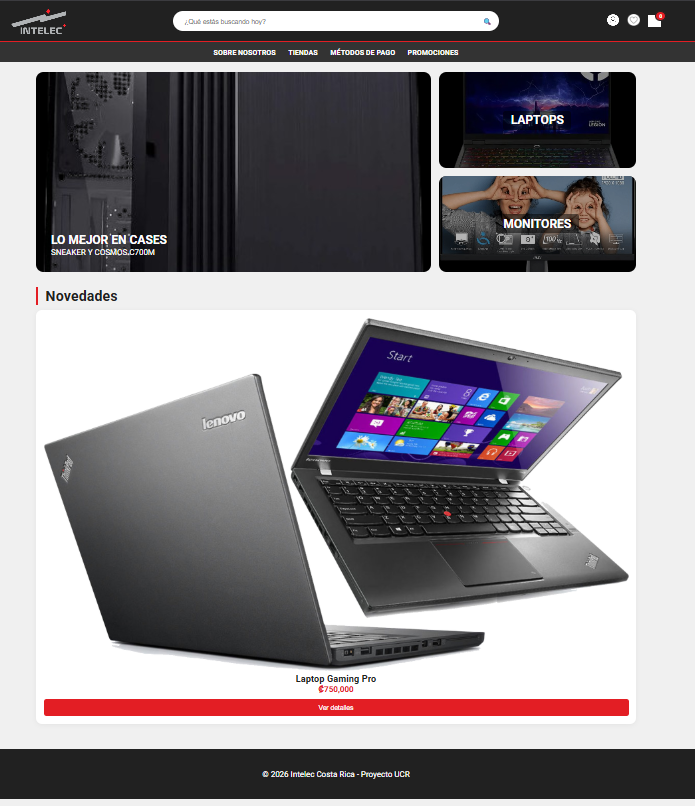
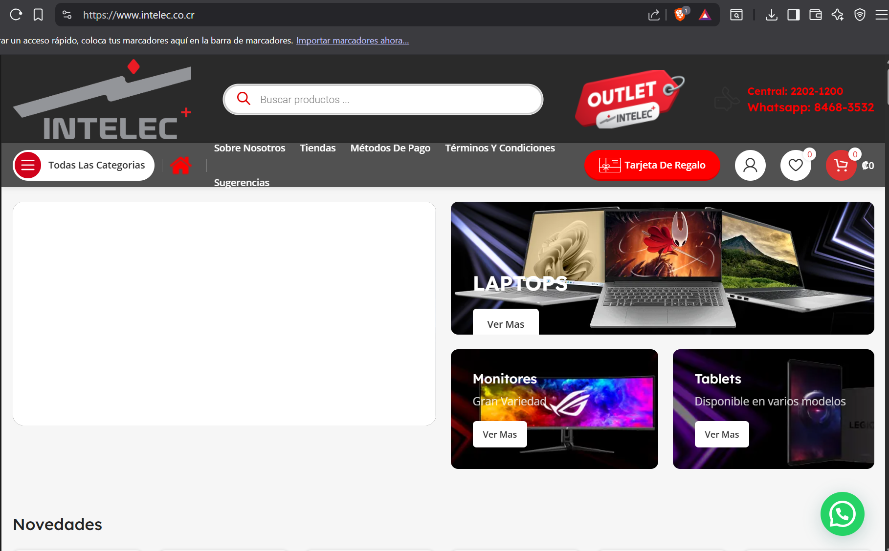

# Clon de Intelec - Tarea 1 Desarrollo Web
Proyecto realizado para el curso de Desarrollo Web en la **Universidad de Costa Rica, Sede Guanacaste**.

## 📸 Vista Previa del Proyecto
https://www.intelec.co.cr/

*Comparativa del diseño final implementado con HTML5 y CSS3.*

## 🛠️ Tecnologías Utilizadas
* **HTML5**: Estructura semántica (header, nav, main, section).
* **CSS3**: Variables, Grid Layout para los banners y Flexbox para el header.
* **Google Fonts**: Implementación de la fuente 'Roboto'.

## 📋 Requisitos Cumplidos
* [x] Uso de Variables CSS (Requisito 18).
* [x] Selectores de elemento, clase y pseudo-selectores (Requisito 17).
* [x] Manejo de especificidad en botones de formulario (Requisito 19-20).
* [x] Diseño responsivo básico mediante Grid.

## ✒️ Autor
* **Kener Sosa Rodríguez C37730** - Estudiante de Informática Empresarial.